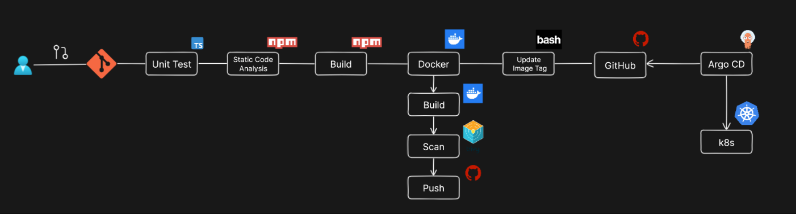

CI/CD file ``ci-cd.yml`` can be found under ``.github/workflows``.

## Technologies Used

- React 18
- TypeScript
- Tailwind CSS
- Lucide React for icons

## Project Structure

```
src/
├── components/
│   ├── Board.tsx       # Game board component
│   ├── Square.tsx      # Individual square component
│   ├── ScoreBoard.tsx  # Score tracking component
│   └── GameHistory.tsx # Game history component
├── utils/
│   └── gameLogic.ts    # Game logic utilities
├── App.tsx             # Main application component
└── main.tsx           # Entry point
```

## Game Logic

The game implements the following rules:

1. X goes first, followed by O
2. The first player to get 3 of their marks in a row (horizontally, vertically, or diagonally) wins
3. If all 9 squares are filled and no player has 3 marks in a row, the game is a draw
4. Winning combinations are highlighted
5. Game statistics are tracked and displayed

## Getting Started

### Prerequisites

- Node.js (v14 or higher)
- npm or yarn

### Installation

1. Clone the repository:
   ```bash
   git clone https://github.com/kokouvishna/devsecops_lab.git
   cd devsecops_lab/devsecops_pipeline_implementation_tictactoe_game
   ```

2. Install dependencies:
   ```bash
   npm install
   # or
   yarn
   ```

3. Start the development server:
   ```bash
   npm run dev
   # or
   yarn dev
   ```

4. Open your browser and navigate to `http://localhost:5173`

## Building for Production

To create a production build:

```bash
npm run build
# or
yarn build
```

The build artifacts will be stored in the `dist/` directory.


### Build and run the docker image locally
```
docker build -t tictactoe:v1 .
```
`-d` run in the background. 
```
docker run -d -p 9000:80 tictactoe:v1
```

### Tokens
#### PAT
Under ``settings`` > ``Developer settings`` > ``Personal access tokens`` > ``Tokens (classic)`` create a new PAT
#### Secrets
Under ``Settings`` > ``Security`` > ``Secrets and variables`` > ``Actions`` create a new repository secrets token.
Name is ``TOKEN``, ans secret ist the PAT we created earlier.